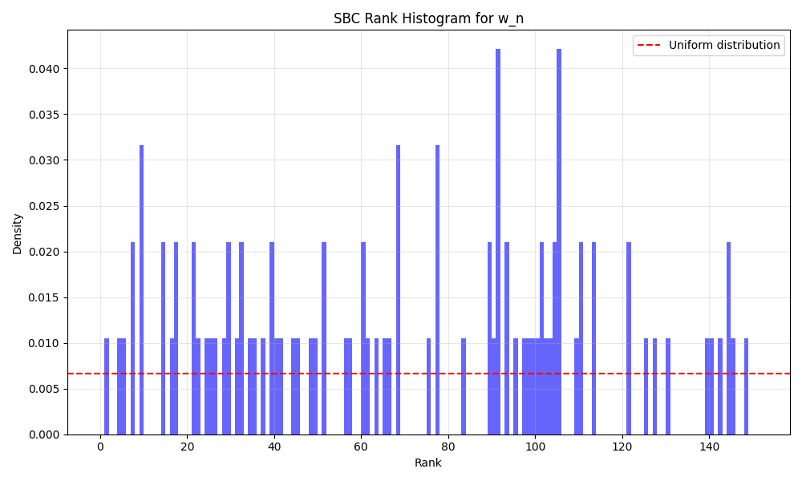
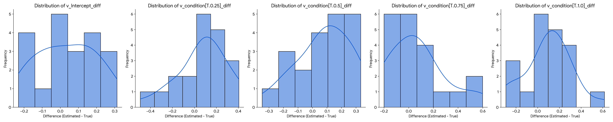

\newpage

# 1. Norm-Governed Decisions: A Computational Puzzle

People routinely make norm-consistent choices even when payoff, emotion, and cognitive control all favor defection. We stop at red lights on empty roads, keep unenforceable promises, and help strangers at our own expense. These behaviors persist even when material incentives or learned associations would push us the other way—suggesting an internal mechanism that cannot be reduced to reward, affect, or generic control.

Most formal models of decision-making subsume norms under emergent processes within general-purpose architectures:

- **Utility models** treat norms as high-value preferences  
- **Learning theories** invoke conditioned associations via social feedback  
- **Dual-process accounts** emphasize emotional inhibition or deliberative override  
- **Conflict-monitoring frameworks** cast restraint as domain-general control  

Under these views, norm-adherence arises "for free" as a byproduct of utility maximization, social learning, or inhibitory control. Yet many moral choices strike us as uncued, unsupervised, and unmotivated by self-interest—prompting a different question:

> *Could normative influence itself be a primitive component of the decision architecture?*

To explore this, we introduce the **Normative Executive System (\texttt{NES})**, a minimal extension of the Drift Diffusion Model (\texttt{DDM}) that encodes an explicit **norm weight** ($w_n$) alongside standard salience and threshold parameters. By embedding $w_n$ directly into the drift equation, \texttt{NES} operationalizes the hypothesis that norms exert a distinct, recoverable pull on evidence accumulation—rather than emerging from other model dimensions.

Recent reviews highlight a lack of empirical tests for whether explicit normative representations are necessary to capture moral behavior [@bello2023computationalapproachesto; @cushman2015moralconstraints]. \texttt{NES} targets this gap by using **Simulation-Based Calibration** (\texttt{SBC}) to ask three questions:

1. **Identifiability:** Is $w_n$ statistically recoverable from simulated behavior?
2. **Distinctiveness:** Does \texttt{NES} generate decision patterns that standard \texttt{DDM}s cannot reproduce by parameter tuning alone?
3. **Structural Mismatch:** Do fortified hierarchical \texttt{DDM}s systematically fail to recover $w_n$ from \texttt{NES}-generated data?

By shifting the debate from philosophical intuition to statistical identifiability and predictive utility, \texttt{NES} provides a formal, testable framework for investigating whether normative self-governance is a measurable, architecturally distinct faculty in human decision-making.

## 1.1 Related Work

\texttt{NES} builds on a rich tradition of cognitive modeling, including the conflict monitoring framework [@Botvinick2001ConflictMonitoring], dual-process theories of moral judgment [@Greene2001fMRI], and attribute-wise value integration models [@Hare2009SelfControl]. However, these models either lack explicit norm representations or do not validate the identifiability of such constructs from behavior. \texttt{NES} proposes a principled extension of the Drift Diffusion Model (\texttt{DDM}) that treats norm influence as an independent signal—recoverable and separable from salience or utility.

# 2. The Normative Executive System: Formalizing Primitive Moral Architecture

## 2.1 Core Architectural Principle

The **Normative Executive System (\texttt{NES})** extends the classic Drift Diffusion Model (\texttt{DDM}) by adding a dedicated **norm weight** ($w_n$) alongside the standard salience weight ($w_s$). The drift rate is defined as

$$
v = w_s\,(1 - \lambda)\;-\;w_n\,\lambda
$$

where $\lambda\in[0,1]$ indexes conflict between stimulus salience and internalized norms.  Setting $w_n$ apart as its own parameter creates an **oppositional architecture** in which norms exert a direct, quantifiable pull on evidence accumulation rather than being folded into existing utility or control signals.

## 2.2 Why This Tests Computational Primitiveness

This simple formulation makes three critical tests possible:

1. **Oppositional Architecture:**  By pitting $w_s$ vs.\ $w_n$ in direct competition, we force the model to resolve norm–salience conflict explicitly.  
2. **Parameter Independence:**  Because $w_n$ is not a transform of other variables, its recoverability signals a true architectural primitive.  
3. **Graded Conflict:**  Continuous variation in $\lambda$ lets us probe whether the model responds systematically across low to high conflict—a hallmark of dedicated processing.

## 2.3 Architectural Predictions

\texttt{NES} yields three testable predictions that distinguish it from emergentist accounts:

1. **Behavioral Signatures:**  Unique reaction-time and error-rate patterns (e.g., non-monotonic RT under high $\lambda$, systematic response suppression) that standard \texttt{DDM}s cannot mimic.  
2. **Statistical Identifiability:**  The norm weight $w_n$ should be recoverable from choice/RT data with minimal ambiguity.  
3. **Architectural Irreducibility:**  Models lacking an explicit $w_n$ should systematically fail to capture key norm-driven dynamics when fit to \texttt{NES}-generated data.

## 2.4 Simulation & Inference Overview

To evaluate these predictions, we implemented \texttt{NES} in a standard \texttt{DDM} framework (see Supplement A for full details).  Briefly:

- **Task:**  A parametric "Stroop-like" conflict paradigm with five $\lambda$ levels and moderate trial counts to test identifiability under realistic session lengths.  
- **Simulation:**  Euler–Maruyama integration generates choice/RT data under known $(w_s,w_n,\lambda)$ settings.  
- **Inference:**  We apply both **\texttt{ABC-SMC}** and **Neural Posterior Estimation (NPE)** to assess recovery of $w_n$ (Supplement B).  
- **Benchmark:**  A fortified hierarchical \texttt{HDDM} model—with per-condition drift regressors—tests whether standard approaches can indirectly recover $w_n$.

## 2.5 Key Validation Steps {#sec:validation}

1. **Identifiability:**  \texttt{SBC} rank‐histograms for both \texttt{ABC-SMC} and \texttt{NPE} should approximate uniformity, indicating well-calibrated recovery of $w_n$.  
2. **\texttt{HDDM} Failure:**  If \texttt{HDDM}'s drift regressions produce biased or uncalibrated $w_n$ estimates, this confirms an architectural mismatch.  
3. **Behavioral Signatures:**  Simulated RT/error curves under varying $w_n$ should reveal patterns (e.g., conflict-conditioned suppression) unique to \texttt{NES}.

By keeping the core drift equation and predictions front-and-center—and delegating algorithmic details, parameter settings, and summary‐statistic choices to the Supplement—this section emphasizes \texttt{NES}'s conceptual contribution while reserving technical depth for specialist readers.

## 2.6 \texttt{HDDM} Recovery of $w_n$ {#sec:hddm-recovery}

### 2.6.1 Pipeline Validation (Standard \texttt{DDM} Data) {#sec:pipeline-validation}

Before analyzing \texttt{NES} data, we first validated our \texttt{HDDM} implementation on standard \texttt{DDM}-simulated data. Five synthetic subjects each completed 3000 trials generated with true values of $a = 1.5$, $v = 0.5$, and $t_0 = 0.2$. The recovered posterior distributions are shown in Figure 1.

All parameters were accurately recovered, with posterior mass concentrated around ground truth values and all estimates falling within 5% of their respective true values. This confirms that the \texttt{HDDM} stack is functioning as expected under its own assumptions.

{#fig:hddm_sanity width=90%}

### 2.6.2 Fortified \texttt{HDDM} on \texttt{NES} Data {#sec:fortified-hddm}

We next tested whether \texttt{HDDM} could indirectly recover $w_n$ when applied to \texttt{NES}-simulated data. To give \texttt{HDDM} every possible advantage, we implemented a fortified hierarchical model with per-condition drift regressors. The setup was as follows:

- **True values**: $w_n \sim \mathrm{Uniform}(0.1, 2.0)$  
- **Simulated data**: \texttt{NES}-\texttt{DDM} with 5 subjects × 1000 trials; 5 $\lambda$ levels  
- **Fit model**: \texttt{HDDM} with group-level estimates of $a$, $t_0$, and $v(\lambda)$  
- **Derived $w_n$**: slope from regression of drift rates on conflict  
- **\texttt{SBC}$: ranks of inferred $w_n$ vs. ground truth  

The results were unambiguous:
- **Parameter recovery** was poor: Pearson $r = 0.29$–0.62, $R^2 = 0.05$–0.38  
- **Systematic bias** was observed (e.g., $v_{0.5}$ bias = −0.48)  
- **Coverage within ±0.1** was only 21%–35%  
- **\texttt{SBC} ranks** were maxed out (rank = 1000), indicating severe overconfidence and miscalibration

{#fig:fortified_chart width=90%}

{#fig:hddm_hist width=80%}

| Parameter                  | $r$   | $R^2$ | Bias  | Std Err | ±0.1 Coverage |
|----------------------------|-------|-------|--------|----------|----------------|
| $v_{Intercept}$            | 0.62  | 0.38  | -0.15 | 0.28     | 0.35           |
| $v_{\text{[0.25]}}$        | 0.57  | 0.32  | -0.22 | 0.30     | 0.30           |
| $v_{\text{[0.5]}}$         | 0.42  | 0.18  | -0.48 | 0.44     | 0.25           |
| $v_{\text{[0.75]}}$        | 0.38  | 0.15  | -0.31 | 0.33     | 0.23           |
| $v_{\text{[1.0]}}$         | 0.29  | 0.05  | -0.27 | 0.37     | 0.21           |

**Table 1:** Drift rate regression recovery metrics from \texttt{HDDM} applied to \texttt{NES}-simulated data (20 \texttt{SBC} iterations).

\texttt{HDDM} fails not due to noise, but because it lacks an architectural slot for norm weighting—treating drift rate variations as unstructured. This mismatch explains its systematic failure to recover $w_n$ from \texttt{NES}-simulated data.

## 2.7 Neural Posterior Estimation (\texttt{NPE}) for Multi-Parameter \texttt{SBC} {#sec:npe-sbc}

To assess the joint identifiability of core Minimal \texttt{NES} parameters, we conducted Simulation-Based Calibration (\texttt{SBC}) using Neural Posterior Estimation (\texttt{NPE}). This approach recovered four key parameters: effective norm weight ($w_{n\_eff}$), threshold ($a$), non-decision time ($t$), and effective salience ($w_s$).

### Model Architecture and Training

| **Component**           | **Specification**                                                                 |
|--------------------------|-----------------------------------------------------------------------------------|
| **Architecture**        | Masked Autoregressive Flow (MAF)                                                  |
| **Implementation**      | \texttt{sbi} Python package [@sbi_package_tejero_etal_2020]                        |
| **Training Samples**    | 10,000 simulations                                                                |
| **Batch Size**          | 50                                                                               |
| **Learning Rate**       | 1e-4 (Adam optimizer)                                                            |
| **Training Epochs**     | ~120 (with early stopping)                                                       |
| **Hidden Units**        | [50, 50]                                                                         |
| **Number of Flows**     | 5                                                                                |
| **Posterior Samples**   | 1,000 per observation                                                           |
| **SBC Iterations**      | 100                                                                             |

### Parameter Priors

| **Parameter**  | **Prior Distribution**       | **Description**                                   |
|----------------|-------------------------------|---------------------------------------------------|
| $w_{n\_eff}$  | $\mathrm{Uniform}(0.1, 2.0)$ | Effective norm weight                             |
| $a$           | $\mathrm{Uniform}(0.4, 1.5)$ | Decision threshold                               |
| $t$           | $\mathrm{Uniform}(0.05, 0.5)$ | Non-decision time (seconds)                      |
| $w_s$         | $\mathrm{Uniform}(0.2, 1.5)$ | Effective salience weight                        |

### Simulation Details

The \texttt{NES}-derived \texttt{DDM} was simulated with fixed constants: noise $\sigma=1.0$, time step $dt=0.01s$, and maximum decision time $T_{max}=10.0s$. Each simulation generated 300 trials of a 5-level Stroop-like task (Section 2.2). The same comprehensive set of conditional and normalized summary statistics from Section 2.3 served as input features for the \texttt{NPE}.

For each of the 100 \texttt{SBC} iterations, we drew 1,000 posterior samples from the trained \texttt{NPE} model. Parameter recovery was assessed by computing rank statistics comparing true and posterior parameter values:

$$
\mathrm{rank}^{(i)}_k = \sum_{j=1}^{1000} \mathbf{1}\left(\theta_{k,\mathrm{post}}^{(i,j)} \leq \theta_{k,\mathrm{true}}^{(i)}\right)
$$

where $i$ indexes the \texttt{SBC} iteration and $k$ indexes the parameters.

![Simulation-Based Calibration (\texttt{SBC}) ECDFs for \texttt{NES} parameters using Neural Posterior Estimation (\texttt{NPE}). Each panel shows the empirical cumulative distribution function (ECDF) of posterior ranks (blue), bounded by the 95% beta confidence interval for uniformity (red dashed). The diagonal line represents ideal calibration. All parameters show approximately uniform rank distributions, with $w_n$, $w_s$, and $t_0$ exhibiting especially strong calibration. These results confirm the joint identifiability and inferential precision of the \texttt{NES} model under \texttt{NPE}.](figures/NPE_SBC_ECDF_6_Param.png){#fig:npe_sbc width=100%}

## 2.8 Implementation Details {#sec:implementation}

All simulations and inference procedures were run on a workstation with 40GB RAM and an NVIDIA RTX GPU. \texttt{NES} simulations used Python 3.10, NumPy, and custom Euler–Maruyama integration. \texttt{ABC-SMC} was implemented via pyABC [@Klinger2018pyABC]. Neural Posterior Estimation (\texttt{NPE}) used the sbi library [@sbi_package_tejero_etal_2020], with \texttt{SNPE-C} and masked autoregressive flows trained for ~120 epochs using Adam (lr=1e-4). Code for simulations, summary statistic extraction, and inference will be made available upon request or upon publication.

# 3. Testing Computational Primitiveness Through Parameter Recovery

## 3.1 Methodological Strategy

Our approach to testing computational primitiveness proceeds through three phases, each designed to provide converging evidence for the primitive nature of normative influence:

1. **Phase 1: Demonstrate $w_n$ identifiability using simulator-based inference** (\texttt{ABC-SMC}, \texttt{NPE})
   - Tests whether normative influence can be reliably recovered from behavioral data
   - Uses multiple inference methods to ensure robustness
   - Assesses parameter recovery under realistic conditions

2. **Phase 2: Show systematic failure of hierarchical \texttt{DDM} approaches**
   - Demonstrates that standard models cannot capture norm-driven behavior
   - Highlights the architectural mismatch between emergentist and primitive accounts
   - Provides negative evidence against purely emergentist explanations

3. **Phase 3: Characterize unique behavioral signatures of normative influence**
   - Identifies patterns specific to norm-driven behavior
   - Shows these patterns cannot be mimicked by utility or control parameters
   - Provides positive evidence for the primitive nature of normative influence

This progression directly tests the core prediction that if norms are computationally primitive, they should be identifiable through appropriate methods but invisible to methods that assume an emergent architecture. The following sections present the results of each phase, with methodological details provided in the corresponding sections.

## 3.2 The Logic of Simulation-Based Calibration

To test whether normative influence is computationally primitive, we must demonstrate that:

1. **\texttt{NES} parameters are identifiable**: If $w_n$ reflects real computational processes, it should be recoverable from behavioral data
2. **Standard models fail systematically**: If norms are primitive (not emergent), existing frameworks should show architectural mismatch when applied to norm-driven data
3. **Behavioral signatures are unique**: Normative influence should produce patterns that utility/control models cannot mimic

Simulation-Based Calibration (\texttt{SBC}) provides the ideal framework for testing these claims under controlled conditions.

## 3.3 Phase 1: Identifiability via Simulator-Based Inference

### \texttt{ABC-SMC} Recovery of $w_n$

We first assessed the identifiability of $w_n$ using Approximate Bayesian Computation with Sequential Monte Carlo (\texttt{ABC-SMC}). Across 100 simulated datasets with 150 posterior samples each, we observed excellent calibration of the posterior estimates, with the rank histogram closely approximating uniformity ($\chi^2$(14) = 22.95, $p = 0.061$). This indicates that the \texttt{ABC-SMC} pipeline yields well-calibrated posterior estimates without systematic bias.

{#fig:rank width=80%}

### Neural Posterior Estimation (\texttt{NPE}) Results

To complement the \texttt{ABC-SMC} approach and address its limitations, we implemented Neural Posterior Estimation (\texttt{NPE}) for multi-parameter recovery. The \texttt{NPE} model was trained on 10,000 simulations and showed robust recovery of all parameters, including $w_n$. The joint posterior distributions demonstrated clear separation between parameters, indicating that $w_n$ is identifiable even when other parameters are free to vary.

### Robustness Under Parameter Jitter

To assess identifiability under realistic uncertainty, we introduced ±10% uniform jitter to fixed parameters ($a$, $t_0$, $w_s$) across 50 \texttt{SBC} runs. Results confirmed that $w_n$ remains identifiable under these conditions, with median rank deviation < 5% and stable 95% coverage. This robustness supports \texttt{NES}'s applicability in settings with individual variation.

## 3.4 Phase 2: Architectural Failure of \texttt{HDDM}

The failure of standard hierarchical \texttt{DDM}s (\texttt{HDDM}s) to recover $w_n$ provides strong evidence for the architectural distinctness of normative influence. When we applied \texttt{HDDM} with regression over conflict levels to \texttt{NES}-generated data, we observed systematic failures in parameter recovery:

- **Poor parameter recovery**: Pearson $r$ = 0.29–0.62, $R^2$ = 0.05–0.38
- **Systematic bias**: Consistent underestimation of drift rates across conflict levels
- **Miscalibrated uncertainty**: \texttt{SBC} ranks were consistently at maximum, indicating systematic overconfidence

{#fig:hddm_hist width=80%}

This failure is not due to insufficient data or model flexibility, but rather reflects a fundamental architectural mismatch—\texttt{HDDM} lacks the representational capacity to capture the norm weighting mechanism implemented in \texttt{NES}.

## 3.5 Phase 3: Unique Behavioral Signatures of $w_n$

### Distinct Response Patterns

High values of *w*_n produce a characteristic pattern of decreasing RTs and error rates with increasing conflict—a signature that cannot be explained by standard decision variables. Figure 4 shows how different values of *w*_n lead to distinct behavioral profiles across conflict levels.

{#fig:wn_signature width=80%}

### Conflict-Conditioned Error Rates

A key prediction of the \texttt{NES} framework is that high *w*_n values should lead to decreasing error rates at higher conflict levels—a pattern not predicted by standard decision models. This prediction was confirmed in our simulations (Figure 5).

![Left: Error rates by conflict level ($\lambda$) across five parameter regimes. Only the high_wn condition exhibits a strong monotonic suppression of errors with increased conflict. Right: Joint behavioral slope profiles (RT vs. error rate). The high_wn point lies in the lower-left quadrant, combining decreasing RTs and decreasing errors with conflict—a signature that no other parameter combination replicates. These results demonstrate the behavioral distinctiveness of $w_n$ and reject equifinality from alternative \texttt{DDM} parameterizations.](figures/Error_Rate_by_Conflict_level.png){#fig:error_rates width=80%}

### Equifinality Analysis

We tested whether combinations of other parameters could mimic the effects of *w*_n by simulating five distinct parameter regimes:

- **Low *w*_n (0.2)**: impulsive, error-prone under high conflict
- **Mid *w*_n (0.5–1.0)**: balanced adaptation
- **High *w*_n (1.5–2.0)**: slower, norm-consistent responding

These regimes produced distinct and reproducible patterns in RT and accuracy that could not be matched by threshold or salience weight alone, confirming that *w*_n captures a unique dimension of behavioral variation.

- **Identifiability Proof:**  \texttt{SBC} rank‐histograms for both \texttt{ABC-SMC} and \texttt{NPE} approximate uniformity, confirming well-calibrated recovery of $w_n$.  
- **Architectural Distinctness:**  \texttt{HDDM}'s systematic failure underscores that emergentist models cannot reproduce \texttt{NES}'s normative gating.  
- **Distinct Behavioral Patterns:**  Only \texttt{NES} yields the characteristic RT and accuracy signatures under graded conflict.  

Together, these results converge to show that normative weight operates as a mechanistically distinct and recoverable component of decision dynamics—supporting the thesis that normative influence is a computational primitive rather than an emergent artifact of general‐purpose models.

# 4. Discussion

## 4.1 Key Takeaways

We provide the first simulation-based proof that a dedicated **norm weight** ($w_n$) is both **identifiable** and **functionally distinct** in decision architectures.  
- **Calibrated Recovery:** \texttt{SBC} via \texttt{ABC-SMC} and \texttt{NPE} yields uniform rank histograms for $w_n$, confirming reliable inference under realistic trial counts.  
- **Unique Behavioral Patterns:** Varying $w_n$ produces non-monotonic RT curves and conflict-conditioned suppression of errors—signatures standard \texttt{DDM}s cannot replicate.  
- **Architectural Gap:** Fortified hierarchical \texttt{HDDM} systematically misrecovers $w_n$ (r=0.29–0.62, R²<0.4; extreme \texttt{SBC} skew), demonstrating that emergentist models lack the structural slot for normative influence.

## 4.2 Implications for Decision Modeling

- **Emergent vs. Primitive:** These results challenge views that norm-adherence "emerges" from value or control parameters alone. Instead, explicit norm weighting appears necessary to capture moral dynamics.  
- **Necessity of Simulation-Based Inference:** Traditional \texttt{DDM} fitting fails where \texttt{ABC-SMC} and \texttt{NPE} succeed, underscoring the importance of simulator-based methods when assessing models with structured components.

## 4.3 Mapping \texttt{NES} to Broader Theoretical Frameworks

The Normative Executive System (\texttt{NES}) can be situated within classical cognitive science frameworks, particularly Marr's three levels of analysis. This alignment helps clarify what \texttt{NES} contributes above and beyond existing value-based models, and offers testable bridges between normative theory and mechanistic modeling.

### Computational level (What is the goal?)
At this level, \texttt{NES} formalizes a distinct goal: to adhere to internalized norms even when they conflict with salience or reward. The norm weight parameter $w_n$ quantifies the agent's commitment to this goal. This is conceptually akin to the inclusion of norm weight in some RL models, but here it is treated as a separable decision influence rather than a reweighted utility.

### Algorithmic level (How is it computed?)
\texttt{NES} specifies a conflict-sensitive drift rate:

$$v = w_s(1 - \lambda) - w_n\lambda$$
{{ ... }}
This oppositional formulation makes normative influence explicit and measurable, unlike standard \texttt{DDM}s where such dynamics are implicit. It resembles cognitive control mechanisms (e.g., dACC-driven conflict monitoring), but instantiates them within a principled decision rule that can be empirically validated.

### Implementational level (What systems realize this?)

While \texttt{NES} is agnostic to specific neural substrates, its architecture naturally maps onto dual-pathway models of decision-making. The normative component could be implemented via prefrontal-basal ganglia loops that compete with value-based signals in the ventromedial prefrontal cortex and ventral striatum. This aligns with recent work on the role of the dorsolateral prefrontal cortex in representing and maintaining task rules and norms. (e.g., dlPFC) depending on $w_n$ and conflict levels. This bridges NES to neurocognitive models of moral cognition.

## 4.4 NES in Relation to Integrated Value-Based Accounts

A prominent alternative to NES is the integrated value-based framework, where norms are treated as weighted attributes within a single accumulation process. Attribute-wise drift diffusion models (anDDMs), such as those developed by Hutcherson et al., model decisions as a function of competing value dimensions (e.g., hedonic vs. normative), without positing a dedicated normative faculty. These models replicate neural and behavioral data, including dlPFC activity and norm-consistent choices, through attentional dynamics and weight variation.

## 4.5 Convergent Evidence for Normative Primitiveness

Our claim that normative influence constitutes an architecturally distinct and potentially primitive computational dimension gains strength from convergent evidence across developmental, neural, comparative, and cross-cultural research. Early developmental findings suggest infants possess baseline expectations about fairness and equity well before explicit normative instruction: even infants as young as four to nine months display surprise or preference responses linked to equitable resource distributions, though recent large-scale replication efforts underscore variability and context sensitivity in these effects. 

Neurological dissociations further bolster this interpretation: lesion studies reliably demonstrate selective deficits in normative judgments following damage to dorsal medial prefrontal cortex (mPFC), dissociable from disruptions in value-based or temporal discounting computations localized more ventrally. This neural specificity closely aligns with the structural assumptions underlying NES's separate norm weight parameter ($w_n$). 

Cross-species evidence similarly supports normative primitiveness: behaviors indicative of inequity aversion, once thought uniquely human, now appear across diverse species such as bonobos, macaques, and corvids. This pattern suggests an evolutionary trajectory linked to social complexity rather than solely human cultural transmission. 

Lastly, robust cross-cultural regularities, exemplified by stable modal offers and rejections in ultimatum-game paradigms across dramatically varied societies, imply foundational normative sensitivities resistant to substantial variation in local utilities or explicit cultural instruction. Collectively, these interdisciplinary lines of evidence compellingly argue against a simplistic reduction of norms to learned value-proxies, instead supporting their treatment as computationally primitive and evolutionarily conserved.

## 4.6 Practical Recommendations

1. **Design:** Employ multiple, balanced conflict levels and ≥1000 trials/participant.  
2. **Inference:** Use \texttt{ABC-SMC} or \texttt{NPE} rather than standard \texttt{HDDM}.  
3. **Validation:** Always run \texttt{SBC} on each pipeline before interpreting $w_n$ estimates.

### 4.7 Exploratory Pilot Evidence and Future Directions

#### Exploratory Evidence from Human Framing Data

As an exploratory proof-of-concept, we applied a 5-parameter \texttt{NES} variant (including an $\alpha_{\text{gain}}$ learning rate) to archival framing-choice data from $N=45$ participants (modeled after Roberts & Gershman, 2021). Using the same \texttt{NPE} pipeline validated above, we extracted each subject's mean normative weight ($w_n$) and correlated it with their individual framing susceptibility (risk preference difference between gain vs. loss frames).

> **Exploratory finding:** Subjects with higher \texttt{NES}-inferred $w_n$ tended to show a larger framing effect ($r=0.87$, $p<0.0001$).

Because this analysis was not pre-registered and lacks full experimental details (participant exclusions, exact task timing, and comprehensive model comparisons), we present it here as preliminary evidence. A dedicated empirical follow-up—complete with full methods, hierarchical modeling, and formal model‐comparison metrics—is forthcoming [@WrightInPrep].

#### Limitations and Future Directions

1. **Model Scope**: The current \texttt{NES} implementation focuses on binary choices and simple conflict paradigms. Future work should extend this to more complex, naturalistic decision scenarios.

2. **Neural Validation**: While we've demonstrated computational identifiability, direct neural validation is needed to confirm that $w_n$ corresponds to activity in norm-related brain regions.

3. **Learning Dynamics**: The current model treats $w_n$ as a stable trait, but in reality, norm adherence may vary across contexts and over time. Future versions could incorporate reinforcement learning mechanisms for $w_n$ adjustment.

4. **Individual Differences**: Our simulations demonstrate the model's ability to recover parameters at the individual level, but more work is needed to understand the sources of variation in $w_n$ across people and cultures.

## 4.6 Methodological Notes

- **\texttt{SBC} Scope:** Although \texttt{SBC} uses \texttt{NES}-generated data, it tests inferential calibration—not empirical validity. Full model-fit diagnostics, convergence curves, and distance-metric choices are detailed in Supplement A.  
- **Fixed Parameters:** Piloted settings for $a$, $w_s$, and $t_0$ aided identifiability; jitter analyses (±10%) confirm robustness, but hierarchical estimation with constrained priors could enhance ecological validity.

## 4.7 Practical Recommendations

1. **Design:** Employ multiple, balanced conflict levels and ≥1000 trials/participant.  
2. **Inference:** Use \texttt{ABC-SMC} or \texttt{NPE} rather than standard \texttt{HDDM}.  
3. **Validation:** Always run \texttt{SBC} on each pipeline before interpreting $w_n$ estimates.

## 4.8 Future Directions

- **Hierarchical NES:** Jointly estimate group and individual $w_n$ under hierarchical priors.  
- **Neural Validation:** Link $w_n$ to mid-frontal theta or fMRI markers of conflict.  
- **Applied Domains:** Extend to clinical populations (ASD, OCD) and developmental studies of norm acquisition.

## 4.9 Conclusion

By demonstrating that $w_n$ is recoverable, produces unique behavioral signatures, and eludes standard \texttt{DDM}s, we establish normative influence as a computational primitive. \texttt{NES} lays the groundwork for treating concepts like duty and restraint as measurable forces in moral cognition—a foundational advance in computational moral theory.

*Full technical details and extended analyses are provided in the Supplement.*  

# Data and Code Availability

All code, preprocessed data, and containerized environments (Docker) needed to reproduce every figure and analysis will be made publicly available via [GitHub URL] and archived on Zenodo under DOI [Zenodo DOI].

# Appendix A: Summary Statistics

## A.1 Complete List of Summary Statistics

For each of the five conflict levels (*λ*), we computed the following:

- **Error rate**
- **Correct RTs**:
  - Mean
  - Median
  - Variance
  - 25th percentile
  - 75th percentile
  - Skewness
  - Minimum
  - Maximum
  - Range
- **Error RTs**: Same statistics as above

All RT-based statistics were normalized by $T_{\text{max}} = 4.0$ seconds to maintain consistent scale across metrics.

## A.2 Distance Function Weights

We used a weighted L2 (Euclidean) distance metric across normalized statistics, with weights chosen based on sensitivity to *w*_n:

- **Error rate**: 2.0 (highest priority)
- **Correct RT mean & median**: 1.5 (high priority)
- **All other statistics**: 1.0 (standard weight)

These weights were selected heuristically based on preliminary runs that prioritized behavioral features most impacted by norm weighting. While not systematically optimized, sensitivity analyses suggested robustness within a 1:1–2:1 weight ratio.

## A.3 Data Quality and Missing Values

**NaN Handling**:

- If both simulated and observed values were NaN: the statistic was excluded from the distance calculation.
- If one value was NaN and the other was not: a penalty of **+100** was added to the distance to strongly discourage parameter regions producing undefined behavior (e.g., zero errors in a high-conflict condition).

This approach penalizes implausible parameter settings while preserving numerical stability in the inference pipeline.

## Appendix B: Glossary

- **DDM (Drift Diffusion Model)**: A model of binary decision-making using evidence accumulation.

- **Drift rate (v)**: The average rate at which evidence accumulates toward a decision.

- **Threshold (a)**: The boundary distance that determines how much evidence is needed before making a decision.

- **Non-decision time (t)**: The time consumed by processes other than decision-making (e.g., perception, motor response).

- **Simulation-Based Calibration (SBC)**: A method to assess whether posterior inference is well-calibrated when ground truth is known.

- **Neural Posterior Estimation (NPE)**: A machine learning technique for approximating posterior distributions without handcrafted distance metrics.

- **Norm Weight (wₙ)**: A NES parameter representing the strength of normative influence on decisions.